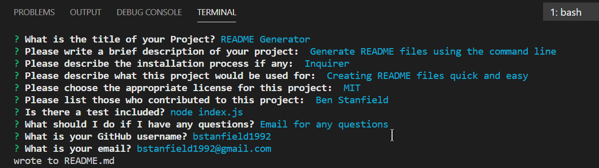

<h1 align="center">README Generator</h1>

## Video
https://drive.google.com/file/d/1O4N_a4ptIXKfqxgWYIbhqpa6U9tmTWN6/view

 
## Description
Generate README files using the command line
## Table of Contents
- [Description](#description)
- [Installation](#installation)
- [Usage](#usage)
- [License](#license)
- [Contributing](#contributing)
- [Tests](#tests)
- [Questions](#questions)
## Installation
Inquirer
## Usage
Creating README files quick and easy
## License

 
This application is covered by the MIT license. 
## Contributions
Ben Stanfield
## Tests
node index.js
## Questions
Email for any questions 
 
GitHub: [bstanfield1992](https://github.com/bstanfield1992) 
 
Email: bstanfield1992@gmail.com  
    